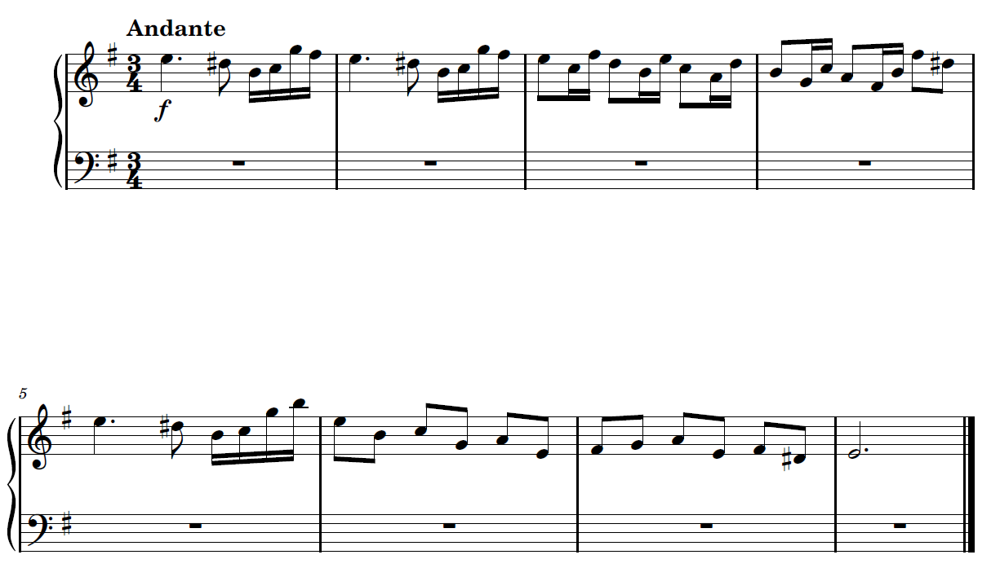
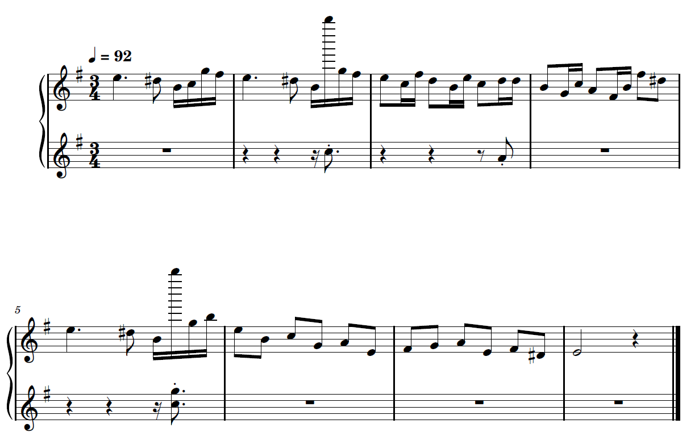
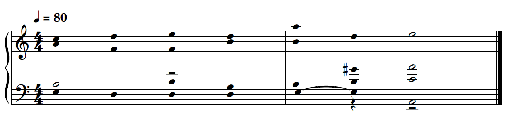
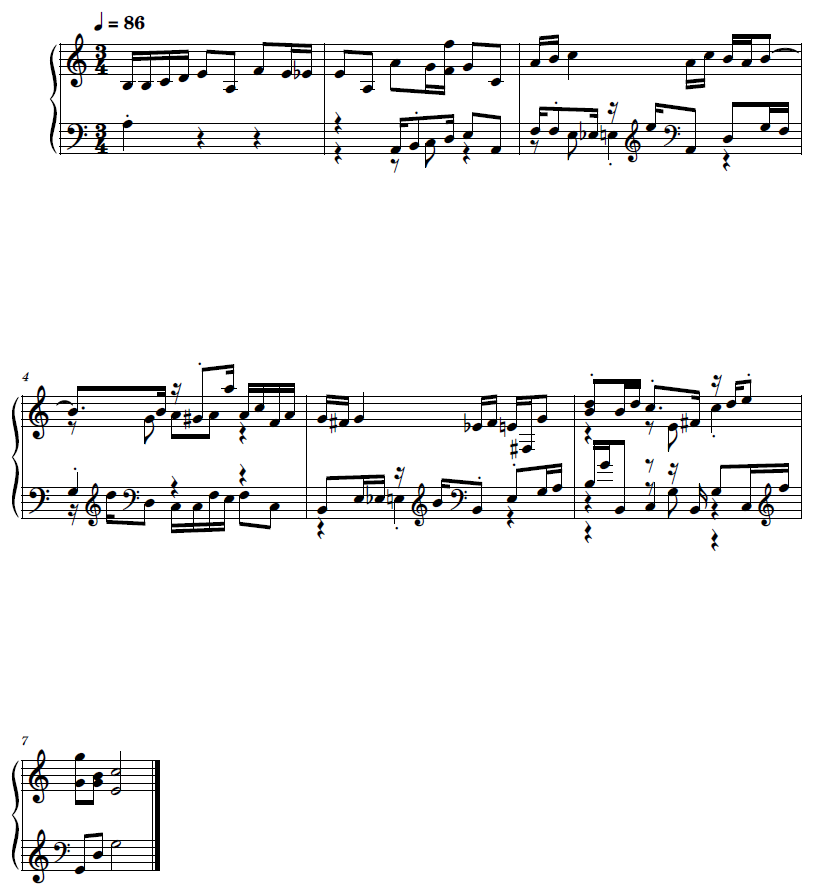

# Arezzo
Arezzo is a simple transcriber for polyphonic piano music. Named after the father of modern day music notation, Guido d'Arezzo.

**This is a school project**

## Usage
You will need MuseScore4 for sheet music generation, otherwise a MIDI file will be generated and saved.

Simply drag a .wav or .mp3 file onto Arezzo.exe or Arezzo.bat. For advanced usage, run `arezzo -h` or `arezzo --help`

`config.toml` contains useful settings.

## Examples
### Monophonic
Original

Generated

### Homophonic
Original

Generated

### Polyphonic
Original

Generated

